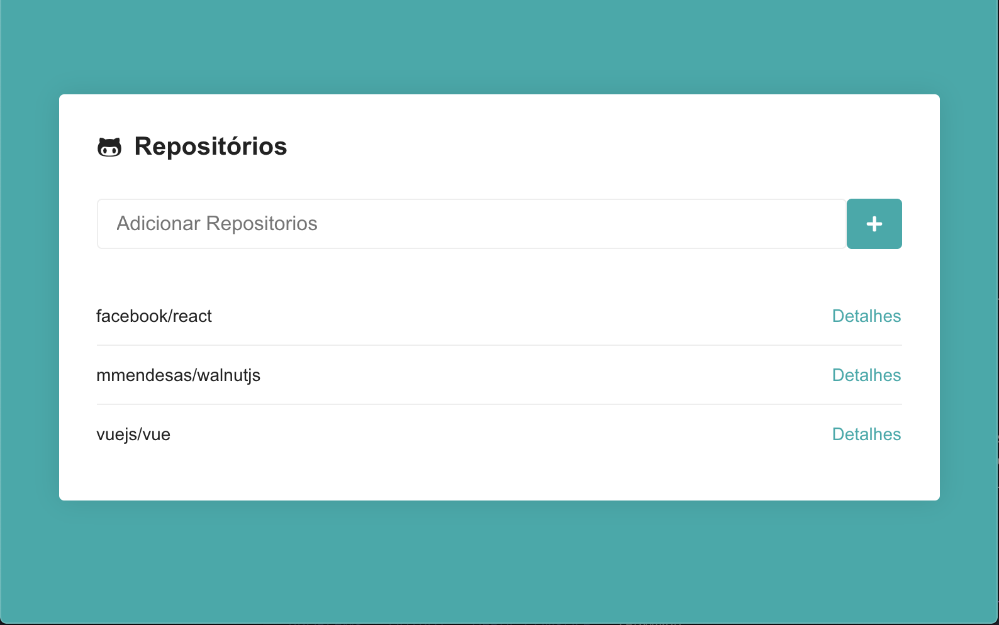

# GitRepo

A simple app in `react` to see github repositories/issues

## What I've learned

- I use a lot of React fundamentals for building all components
- I made some api requests to get real data
- I put my hands again in styled-components \o/

## How to test this implementation

In the project directory, you can run:

- `yarn`: Intalling dependencies
- `yarn start` : Start in development mode

Runs the app in the development mode. 
Open [http://localhost:3000](http://localhost:3000) to view it in the browser.

> Warning: This project use Create React App

## Built With

- [Create React App](https://create-react-app.dev/) - Set up a modern web app by running one command.
- [Axios](https://github.com/axios/axios) - Promise based HTTP client for browser and node.js
- [Styled Components](https://www.styled-components.com/) - Visual primitives for the component age. Use the best bits of ES6 and CSS to style your apps without stress

## Author

- **Marcio Mendes** - [mmendesas](https://github.com/mmendesas)

## License

This project is licensed under the MIT License - see the [LICENSE.md](LICENSE.md) file for details
